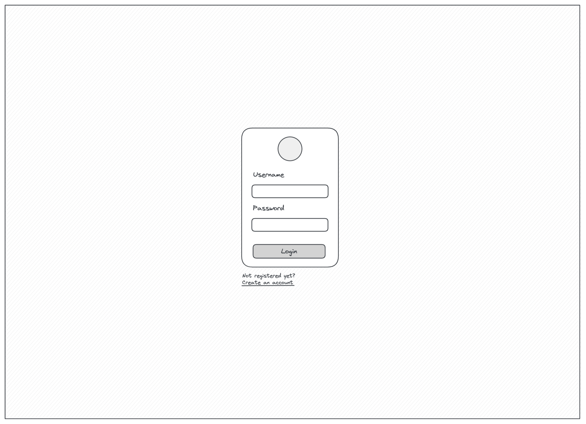
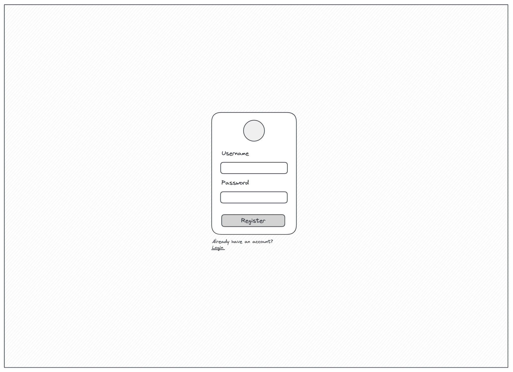

# Spotify Clone

Over the next weeks, we're building a spotify clone. Users can register/login,
play songs, add songs to their own playlists and much more.

## Stack

We're building a webapplication with Next.js, Apollo GraphQL and MongoDB.
Alternatively the existing in memory database can be used, but brings the
downside that state is not persistend.

To not waste so much time, a Turborepo has been prepared with both a Next.js App
and a GraphQL Server App.

In addition, to not waste much time on tedious CSS work, for the frontend we'll
be using the React UI library [mui](https://mui.com/).

Data for artists and songs already exists in the respective `*.data.ts` files.

## Pages / Requirements

- [`/`: Browse](#browse)
- [`/login`: Login](#login)
- [`/register`: Registration](#register)
- [`/artists`: Artists overview](#artists-overview)
- [`/artist/[id]`: Artist detail](#artist)
- [`/playlists`: Playlists overview](#playlists-overview)
- [`/playlist/[id]`: Playlist detail](#playlist)
- [`/liked`: Liked Songs](#liked-songs)

### Browse

**Functionality**

- Displays the title "Browse"
- Displays a list of 5 artists (order by name ascending)
  - Optional: Display a link to the [artists overview](#artists-overview) page
- Displays the [Songlist](#songlist) component with all songs
  - Initially displays up to 5 songs but more can be loaded via "load more" button
  - The load more button is hidden when no more songs can be loaded

### Login

**Functionality**

- The User can login with username and password
- When login is not successfull, an error message is displayed
- When login is successfull, the user will get redirected to the browse page
- Links to the registration page in case the user is not registered yet

### Register

**Functionality**

- The user can register with a username and password
  - The username should contain at least 3 characters and must be unique
  - The password should contain at least 3 characters
- Security is not really part of the tutorial, so the password can be stored unhashed as text
- Upon successfull registration the user is automatically logged in and redirected to the browse page
- Links to the login page in case the user is already registered

### Artists overview

> The Artists overview page is optional

**Functionality**

- Displays the title "Artists"
- Displays a list of artists
  - Initially displays up to 15 artists but more can be loaded via "load more" button
  - The load more button is hidden when no more artists can be loaded
  - Order possibilities:
    - Name ascending (default)
    - Name descending
  - Changing the order resets the pagination
  - The cover of the artist should be displayed
  - The name of the artist should be displayed
  - Links to the [artist](#artist) detail page

### Artist

**Functionality**

- Displays the cover of the artist
- Displays the name of the artist
- Displays the [Songlist](#songlist) component with the songs of the artist
  - Initially displays up to 10 songs but more can be loaded via "load more" button
  - The load more button is hidden when no more songs can be loaded
  - Order possibilities:
    - Date added (default): newest first
    - Name ascending
    - Name descending
    - Duration ascending
    - Duration descending
  - Changing the order resets the pagination

### Playlists overview

> The Playlists overview page is optional

**Functionality**

- Displays the title "Playlists"
- Displays a list of playlists
  - Initially displays up to 15 playlists but more can be loaded via "load more" button
  - The load more button is hidden when no more playlists can be loaded
  - Order possibilities:
    - Name ascending (default)
    - Name descending
  - Changing the order resets the pagination
  - The cover of the playlist should be displayed (first song in the playlist)
  - The name of the playlist should be displayed
  - Links to the [playlist](#playlist) detail page
- Optional: Add a nice empty state, in case the user doesn't have any playlists yet

### Playlist

**Functionality**

- Displays the cover of the first song in the playlist
- Displays the name of the playlist
- Displays the [Songlist](#songlist) component with the songs of the playlist
  - Initially displays up to 10 songs but more can be loaded via "load more" button
  - The load more button is hidden when no more songs can be loaded
  - Order possibilities:
    - Date added (default): newest first
    - Name ascending
    - Name descending
    - Duration ascending
    - Duration descending
  - Changing the order resets the pagination
- Optional: Add a nice empty state, in case the playlist doesn't contain any songs yet

### Liked Songs

**Functionality**

- Displays the cover of the first song in the playlist
- Displays the name of the playlist
- Displays the [Songlist](#songlist) component with the songs of the playlist
  - Initially displays up to 10 songs but more can be loaded via "load more" button
  - The load more button is hidden when no more songs can be loaded
  - Order possibilities:
    - Date added (default): newest first
    - Name ascending
    - Name descending
    - Duration ascending
    - Duration descending
  - Changing the order resets the pagination
- Optional: Add a nice empty state, in case the playlist doesn't contain any songs yet

## Core Components

### Navigation

**Functionality**

- See image for functionality

### Songlist

**Functionality**

- Displays a list of songs
- See image for functionality of the list

### Player

- See image for functionality of the list

## Process / Progress

### 1. Week

Focus on getting started with the Server.

- Getting familiar with the repository
- Hook up a real Database if needed/wanted
  - If you don't, state is not persistent and will be deleted/reset every time the server restarts
- Implement the GraphQL Schema for the existing data of artists & songs
  - Implement the corresponding resolvers to fetch the artists & songs
- Implement the GraphQL Schema for users (registration/login)
  - Implement the corresponding resolvers to register and log in
  - Security is not really part of the exercise, so just storing the password of the user in plain text is fine

### 2. Week

Focus on getting started in the Frontend.

- Add the [ApolloClient](https://www.apollographql.com/docs/react/get-started/) and make your first query from the app
- Implement the registration & the login
  - The ApolloClient should store some information that the user is logged in and send this information with every request as a Request-Header (see [Apollo Link Context](https://www.apollographql.com/docs/react/api/link/apollo-link-context) for help)
- Implement the base Layout of the app
  - Implement the navigation and all the pages (pages can currently be empty)
  - The Paylists functionality (displaying and adding) are not needed yet
- Implement the Browse page
  - Implement the artists list components and fetch artists from the API
  - Implement the songlist component (only displaying information, no functionality yet) and fetch songs from teh API

### 3./4. Week

Finish the project in any order you seem fit.  
Try to finish one chunk after the other instead of trying to finish everything at the same time.

- Implement the Artists overview page (optional)
- Implement the Artists detail page
  - Display the songs in the existing songlist component
  - Add order by & pagination functionalities
- Implement the GraphQL Schema & Resolvers of Playlist, the Liked Songs
- Implement the functionality to add new Playlists
- Implement the display of all of the users Playlists in the navigation
- Implement the Playlists overview page (optional)
- Implement the Playlist detail page
  - Display the songs in the existing songlist component
  - Add order by & pagination functionalities
- Implement the Liked Songs page
  - Display the songs in the existing songlist component
  - Add order by & pagination functionalities
- Implement the functionality of the [songlist](#songlist) component
- Implement the [player](#player)
  - Figgure out how you want to do the state handling of actively playing songs etc.

## Hilfreiche Ressourcen

- Youtube Course with React, Node.js, MongoDB and GraphQL: https://www.youtube.com/watch?v=7giZGFDGnkc&list=PL55RiY5tL51rG1x02Yyj93iypUuHYXcB_&index=1
